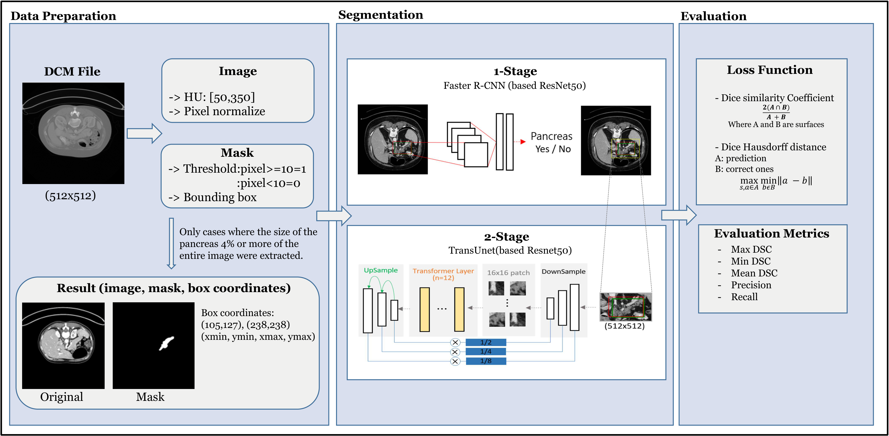
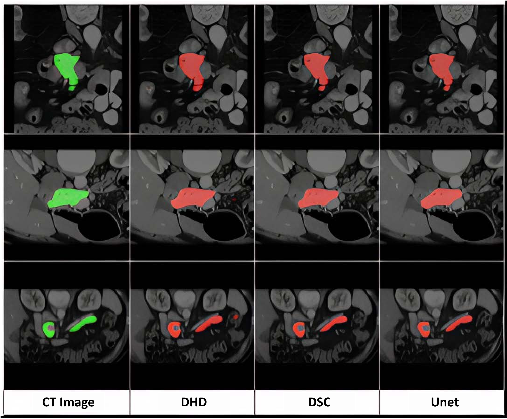

# Pancreas Segmentation with a Two-Stage Pipeline of Faster R-CNN and TransUNet

Official code for the paper:

> **Pancreas Segmentation with a Two-Stage of R-CNN and TransUNet**
> Yunjung Hong, Servas Adolph Tarimo, Jiyoung Woo
> *Applied Sciences* (MDPI), 2026 — Manuscript ID `applsci-4222871`

This repository implements a **two-stage pancreas segmentation framework** for abdominal CT:

```
Full 512×512 CT slice  ──►  Stage 1: Faster R-CNN  ──►  predicted box  ──►  crop
                                                                              │
                                            mask  ◄──  Stage 2: TransUNet  ◄──┘
```

- **Stage 1 — Localization:** a COCO-pretrained **Faster R-CNN (ResNet-50 FPN)** is fine-tuned to detect the pancreas and output a bounding box. The box is expanded (×1.5–2.0) and used to crop the ROI.
- **Stage 2 — Segmentation:** a hybrid **TransUNet** segments the pancreas inside the crop. The model is trained with a **Dice–Hausdorff Distance (DHD) loss** — `L = L_Dice + α·L_surface` — which couples region overlap (Dice) with boundary precision (Hausdorff).

<p align="center">
  
  <br><em>Figure 1. Overall framework — data preparation, two-stage localization + segmentation, and evaluation.</em>
</p>

---

## Results (from the paper)

### Table 3 — NIH Pancreas-CT dataset

| Model | Mean DSC (%) | Std (DSC) | Precision (%) | Recall (%) |
|---|:---:|:---:|:---:|:---:|
| **Faster R-CNN + TransUNet (DHD)** | **88.98** | 17.10 | 91.0 | 94.4 |
| Faster R-CNN + TransUNet (DSC)     | 87.91 | 16.60 | 92.5 | 93.0 |
| U-Net (baseline)                   | 83.6  | 27.1 | 91.1 | 81.6 |

### Cross-dataset evaluation — BTCV (30 volumes)

| Setting | Mean DSC (%) | Std (DSC) | Precision (%) | Recall (%) |
|---|:---:|:---:|:---:|:---:|
| Zero-shot (NIH model, no fine-tuning) | 62.96 | 10.51 | 63.64 | 66.44 |
| Fully automatic (5-fold CV)           | 66.50 | 8.55  | 63.82 | 79.29 |

### Qualitative comparison

<p align="center">
  
  <br><em>Figure 6. Qualitative comparison of segmentation outputs. Columns: CT image with ground truth (green), then predictions from DHD, DSC, and U-Net.</em>
</p>

---

## Repository structure

```
pancreas-rcnn-transunet/
├── inference_time.py             # Shared: create_model() — the TransUNet architecture + timing
│
├── stage1_rcnn/                  # Stage 1 — Faster R-CNN localization
│   ├── step1_rcnn_finetune.py        train the detector (boxes derived from GT masks)
│   └── step2_rcnn_predict.py         run detector → predicted boxes → crops
│
├── stage2_transunet/            # Stage 2 — TransUNet segmentation (Table 3)
│   ├── TransUNet_DiceHD.py           main model, DHD loss → 88.98%
│   ├── TransUnet_Dice.py             Dice-loss variant → 87.91%
│   └── UNet_.py                      U-Net baseline → 83.6%
│
├── data/                        # Data loaders / preprocessing
│   ├── btcv_load_preprocess.py       BTCV NIfTI → slice PNGs
│   └── datacheck.py                  dataset sanity checks
│
├── evaluate_btcv/              # BTCV cross-dataset evaluation
│   ├── btcv_evaluate_v9.py           zero-shot evaluation → 62.96%
│   └── btcv_5fold_cv.py              fully-automatic 5-fold CV → 66.50%
│
├── weights/                     # (place trained checkpoints here — not shipped)
├── outputs/                     # (generated results/checkpoints — git-ignored)
├── requirements.txt
└── LICENSE
```

> **Run scripts from the repository root**, e.g. `python evaluate_btcv/btcv_5fold_cv.py`.
> All scripts import `create_model` from the root-level `inference_time.py`, and resolve `data/`, `weights/`, and `outputs/` relative to the repo root.

---

## Installation

```bash
git clone https://github.com/servasadolph/pancreas-rcnn-transunet.git
cd pancreas-rcnn-transunet

python -m venv .venv && source .venv/bin/activate    # or conda
pip install -r requirements.txt
```

Tested with Python 3.8 and PyTorch (CUDA 11.x).

---

## Datasets

This repository ships **code only** — the CT datasets must be obtained from their original sources (data-use agreements apply):

| Dataset | Use | Source |
|---|---|---|
| **NIH Pancreas-CT (TCIA)** | Main training/eval (Table 3) | The Cancer Imaging Archive |
| **BTCV (Beyond the Cranial Vault)** | Cross-dataset evaluation | Synapse / MICCAI 2015 Multi-Atlas Labeling |

Expected layout after download:

```
data/
├── btcv_datasets/
│   ├── imagesTr/        # img0001.nii.gz … (BTCV volumes)
│   └── labelsTr/        # label0001.nii.gz … (pancreas label == 11)
├── pancreas_ok_dataset/ # NIH cropped slices (train/eval PNGs)
└── data_path_result.csv # NIH image/mask index used by Stage-2 training
```

---

## Trained weights

The NIH-pretrained TransUNet checkpoint **`weights/DICE_HD_best_model_100after.pth`** is required at runtime for both BTCV evaluations (and reused by Stage-2). It is too large for the repository — request it from the authors or download from the release link (to be added), and place it under `weights/`.

---

## How to run

### Stage 1 — Faster R-CNN detector
```bash
python stage1_rcnn/step1_rcnn_finetune.py     # → outputs/rcnn_model/rcnn_best.pth
python stage1_rcnn/step2_rcnn_predict.py      # → outputs/rcnn_predicted_boxes.csv
```

### Stage 2 — TransUNet training (NIH, Table 3)
```bash
python stage2_transunet/TransUNet_DiceHD.py   # DHD model  (88.98%)
python stage2_transunet/TransUnet_Dice.py     # Dice model (87.91%)
python stage2_transunet/UNet_.py              # U-Net baseline (83.6%)
```

### BTCV cross-dataset evaluation
```bash
python evaluate_btcv/btcv_evaluate_v9.py      # zero-shot → 62.96%
python evaluate_btcv/btcv_5fold_cv.py         # fully-automatic 5-fold CV → 66.50%
```

---

## Citation

```bibtex
@article{hong2026pancreas,
  title   = {Pancreas Segmentation with a Two-Stage of R-CNN and TransUNet},
  author  = {Hong, Yunjung and Tarimo, Servas Adolph and Woo, Jiyoung},
  journal = {Applied Sciences},
  year    = {2026},
  note    = {Manuscript ID: applsci-4222871},
  publisher = {MDPI}
}
```

## License

Released under the [MIT License](LICENSE).
